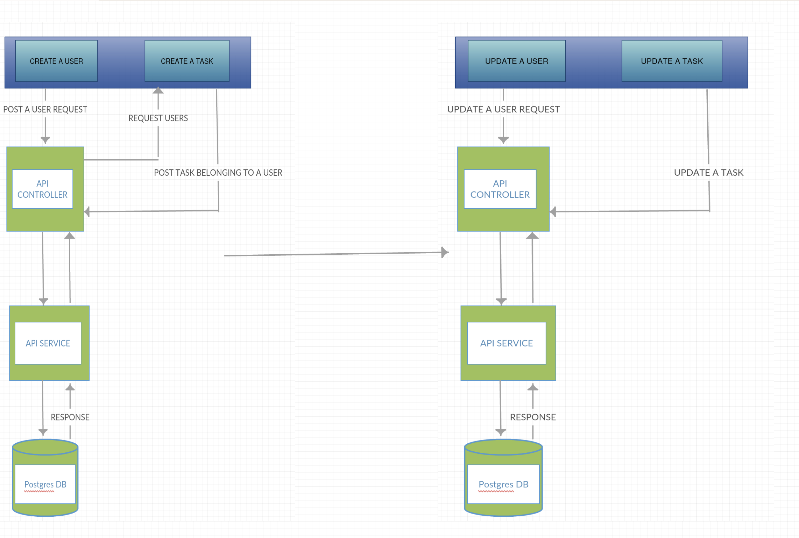

## Description

### The app is a fullstack written in [Angular](https://angular.io/) for [frontend](/frontend) and [NestJs](https://nestjs.com/) for [backend](/backend).

>

### The backend is hosted on [Heroku](https://www.heroku.com/) and frontend on [Netlify](http://netlify.com/). I decided to explore on DevOps, main reason I chose those platforms for hosting.

>

## Frontend

### Hosting URL: `https://todo-frontend.netlify.app/`

### Functionalities

- Create User
- Delete User
- View User's Tasks
- Complete/Uncomplete user's tasks
- Edit User

### Basic Functionalities
* The users and tasks sections are in tabular form, the most right column shows actions that can be performed on a particular entity.
* For users, you can edit, view tasks and delete a user.
* For tasks, you can complete or unconplete a task depending on state and you can delete the task.
* Deleting a user, deletes the associated tasks.
* A newly added task must belong to a user.
## Backend

### Hosting URL: `https://bunny-todo-backend.herokuapp.com/`

### Technologies Used

- NestJs
- TypeORM
- PostgreSQL

## API Functionalities Testing

### I implemented [OpenAPI Specification](https://swagger.io/specification/) for my API documentation that is hosted together with the backend app at this [URL](https://bunny-todo-backend.herokuapp.com/documentation) the app can be thoroughly tested for all API functionalities.

### Creating a Task

- Request Payload

```JSON
{
    "title": "string",
    "description": "string",
    "userId": {"id": "string"}
}
```

- Response

```JSON
{
  "id": "string",
  "title": "string",
  "description": "string",
  "state": "string"
}
}
```

### Editing a Task State

- Requesst Payload

```JSON
{
	"state": "new state"
}
```
* Response 
```JSON
{
  "id": "string",
  "title": "string",
  "description": "string",
  "state": "new state"
}
```
### Editing a Task

- Requesst Payload

```JSON
{
    "title": "string",
    "description": "string",
    "userId": {"id": "string"}
}
```

```JSON

- Response

```JSON
{
  "id": "string",
  "title": "string",
  "description": "string",
  "state": "string"
}
}
```

### Creating a User
* Request Payload
```JSON
{
  "firstname": "string",
  "lastname": "string"
}
```


* Response
```JSON
{
  "id": "string",
  "firstname": "string",
  "lastname": "string"
}
```

## Editing a User 
>(You can either edit firstname, lastname or both)

* Request Payload
```JSON
{
  "firstname": "string",
  "lastname": "string"
}
```

* Response
```JSON
{
  "id": "string",
  "firstname": "string",
  "lastname": "string",
  "tasks": []
}
```

## Block Diagram
<p align="center">
  
</p>
